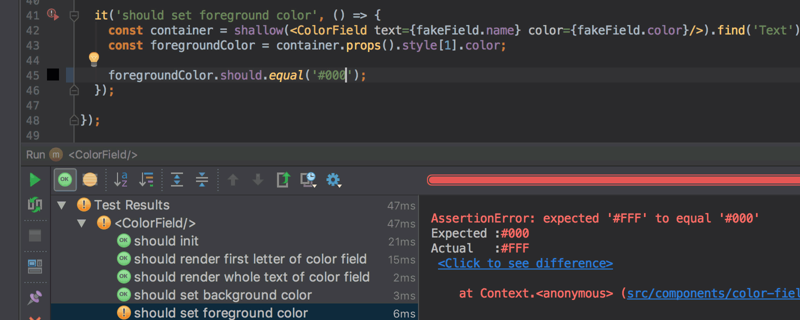
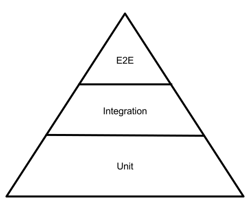

> Testing is the process of executing a program or system with the intent of finding errors. (Myers, 1979) 

Notes: 
- The only definition you will get today, but an important one
- Testing is a systematic approach
- The intent is to find errors
- Common misconception, testing means finding errors, not confirming that it works!
- You confirm that it doesn't work!

---

## Why Care?

1. We don't want to contribute to the hell that is programming today <!-- .element: class="fragment" data-fragment-index="1" -->

2. We want to save our dignity and some money &#x1F4B0; <!-- .element: class="fragment" data-fragment-index="2" -->

3. Both of the above! <!-- .element: class="fragment" data-fragment-index="3" -->

Notes: 
- So, why do you want to make sure your stuff works?
- Gee that sounds like work people say, and they are quite right
- So why should you care about testing, about trying to exterminate bugs
- For one, I think its a bit of ethical responsibility to not contribute to the hellscape that I outlined
- If you are not into ethics, consider brand damage, money damage etc
- Your boss won't be happy if you write something, it gets pushed to production and everything breaks

---

## Types of Errors

Let's focus on Regression Testing

Notes: 
- There are different errors, and different ways to find them through testing
- We are going to focus on regression errors. 
- Imagine you wrote this function
- You try it, it works
- You add some stuff, that new stuff works
- But the old stuff doesn't anymore
- Breaking of stuff that used to work, regression
- Note that figuring out errors in new application code is not a goal here
- You can test the whole application each time you make a change, but that gets old real quick

---

## Test Automation

 

Notes:
- Smart people came up with ways to automate 
- To do that automatically
- You write some tests
- That means code, you write code to test code
- Seems crazy maybe but works pretty well
- And some framework runs those automatically, each time you make a change

---

## Testing Levels

- System: Test the whole system (E2E)
- Integration: Test a couple of components together
- Unit: Test a single unit &#x1F60F;

Notes: 
- Imagine you want to test that if a user clicks on the sign up button and enter their mail they get an email
- You can test that, and we call that an end to end test, because the whole system is involved
- There are also integration tests, that don't quite go through the whole application but some part
- and Unit Tests, which would only test small small tiny parts

---

 <!-- .element: id="testing-pyramid" -->

#### The Testing Pyramid

Notes:
- Who has already seen this? 
- You are probably going to see this an additional 1000 times in your lives
- because this graphic is in literally every talk about testing
- Two reasons: Finding different errors, and maintenance
- What you write you have to maintain
- If your application code changes, you often have to change your tests
- Its just additional work
- and for end to end tests its more work

---

## Let's do some testing!

---

## Summary

- Programming is hard, but testing helps!
- Use regression tests to produce working software
- Test automation and test levels 

Notes:
- Summary

---

## Resources

- The Art of Software Testing, Glenford Myers
- The Art of Unit Testing, Roy Osherove
- [Ministry of Testing](https://www.ministryoftesting.com/)

Send me a message!

[@hschne](https://twitter.com/hschnedlitz)

Notes:
- Summary

---

Slides on [hschne.at/slides](https://hschne.at/slides/)

