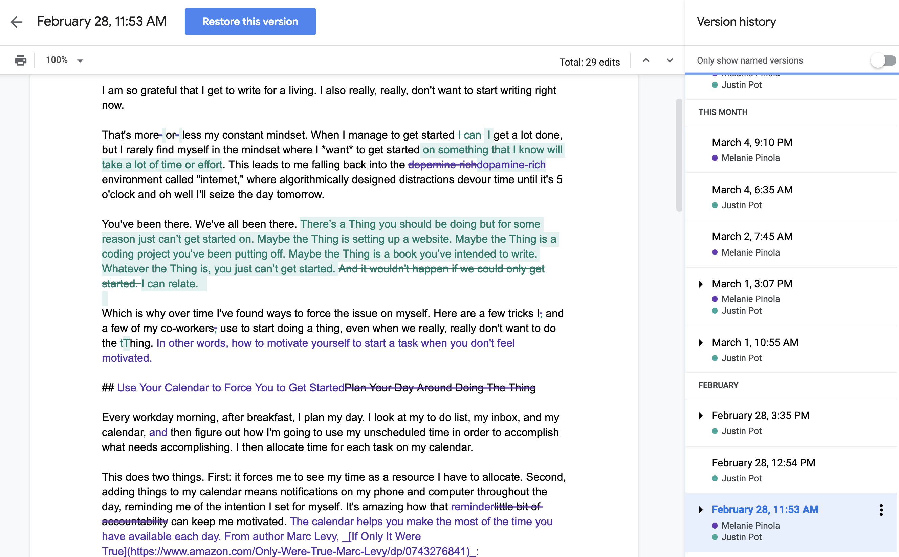
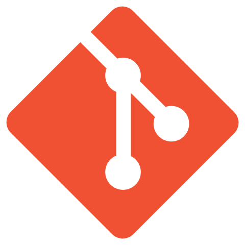
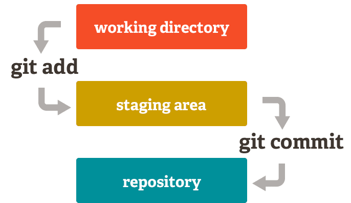
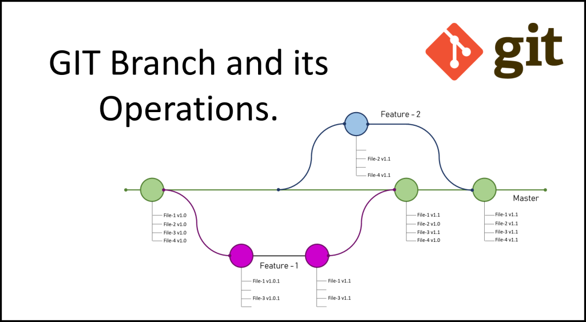
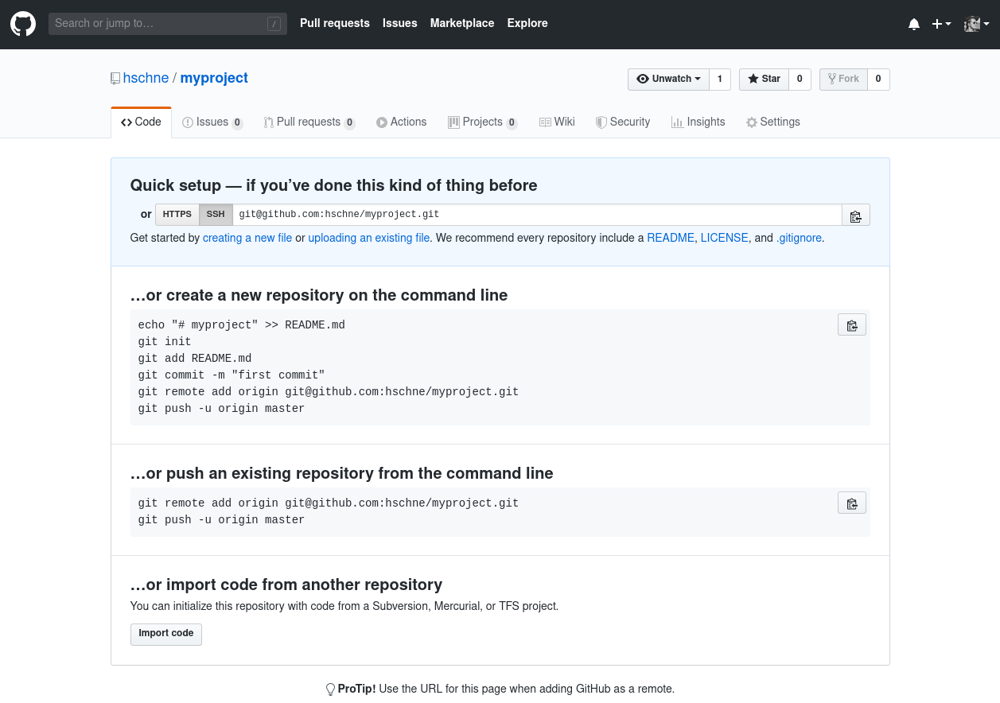

# Overview

1. Intro to Version Control
2. Hands on with Git 💪

Note:

- So what is all of this about.
- Some basics first, so we'll look at version control even means
- Right, you gotta have some basics
- And then we are gonna do like a hands on with git
- So i'll show off what git can do and you can follow along
- On your own laptops if you like, else there will be time later

---

Follow along: [hschne.at/slides](https://hschne.at/slides/)

Note:

- You can follow along right here at hschne.at
- Quick disclaimer also
- This talk is specifically for beginners
- For those who already have lots of experience, not too much new
- But maybe there is, who knows? I mean git is complicated, you might learn something new
- If you follow along, the code samples I'm gonna show off require that you have git installed
- The samples are also for Linux and we are gonna use some basic linux commands
- But i'll explain those when we get there

---

### VCS? Git?

<div>
<blockquote>...is the management of changes to documents, computer programs, large web sites, and other collections of information.</blockquote> 
</div><!-- .element: class="fragment" data-fragment-index="1" -->
<br>
<div>
<blockquote>... allows us to track what happened when and by whom</blockquote> 
</div><!-- .element: class="fragment" data-fragment-index="1" -->

Note:

- So, with that out of the way, lets get started
- Wo here has never before heard of git or version control?
- So, you might have heard of Git, or version control or VCS
- Management of changes, that basically means tracking whatever changed
- In files, documents, any digital entry really
- It means seeing who did what and when
- That means when a file changes you can go back, go forward to newer version
- So as a concept not limited to programming
- But for us developers its super duper important

---



Note:

- Did you know, google also offers version control on their documents?
- So this is what it looks like for google docs.
- You can always have a look at what happened when
- By who
- And revert to previous version
- Obviously we don't use google docs for programming, so what are we using

---

<!-- .slide: data-background-image="img/intro_fire.gif" -->

Note:

- Imagine you work on a project, happily coding along
- Everything is cool, then you reload or recompile
- Everything is broken
- Wouldn't it be nice to know what actually changed?
- Well with version control you can. Even better
- When You work together with someone, and you haven't been able to work on the project for a couple of days
- Cool, with version control you can just have a look and see what the other persons changed

---

<!-- .slide: data-background="#333333" -->
<div class="img-row"> 
  
  
  
</div>

Note:

- There's a bunch of tools to do version control
- Theres subversion and mercurial and git and others
- Don't worry about those, they all do the same thing, I just wanted to mention them
- So you have at least heard them
- We'll concentrate on Git
- Its reasonable to say that it is the most widespread
- It is very powerful
- Also pretty complicated, lots of commands, and can be a bit daunting
- Which is why we are having this talk, right?
- Enough with the basics, lets get our hands dirty

---

## Git

Download at [https://git-scm.com/downloads](https://git-scm.com/downloads)

<br>

## Configuration

```bash
git config --global user.name "your name"
git config --global user.email email@example.com
```

Note:

- In case you are planning on following along you will need to have git installed
- You can get it here, or you know, just google git download
- And then configured it like so,
- We'll not go into details of what this actually does
- Let's just say it lets git know who you are
- And it needs to know that otherwise some of the other commands we'll see later won't work

---

## Initializing...

```bash
mkdir myproject # Create a new directory
cd myproject # Change into the directory
echo 'Content' >> new_file.txt # Create a file with some content
git init # Initialize a repository
git status # View status of the repository
```

Note:

- What's our premise?
- So lets say we have a basic project, we are developing something
- That we want to track some changes in it
- Obviously, we are not going to program something for real, because there is no time for that
- But we'll create some dummy data, and hightlight how git works based on that
- So the first line just creates a new folder in the current directory
- Change into it, then create a new file with some dummy content
- You can create that folder and file any way you like
- But I do it over the command line, because its easy like that
- Then lastly we call git init to intialize a repository
- What is a repository, its basically the system that tracks changes
- That means all things that happen in that repository we can track
- Lets just do that for real

--

<!-- .slide: data-background="#ffffff" -->


Note:

- So I have an empty directory here
- I'll create a new folder
- Gues what cd stands for, change directory that's right
- And we create our file
- We can run cat to show the content of a file
- So yeah, we have a file with content
- and now let's initialize our git repo
- We run git status to show the status of the repository
- And that tells us a bunch of interesting stuff
- Branch master, ignore that for now
- It tells us there are no commits yet, we'll get to that in a second
- And then it tells us that there are some untracked files
- And we should use git add to track those

---

## Adding files

```bash
git add 'new_file.txt' # Add changes to the staging area
git status
git commit -m 'Add initial changes' # Commit changes
git log # View history
```

Note:

- So that is important to understand
- Not every change is tracked automatically, you have to create versions yourself
- You can do that by using add
- But that doesn't immediatly create a new version
- Instead it adds it to a staging area
- Once a change is in the staging area you can commit it
- That is: Create a new version
- Only then you have actually sucessfully tracked a change that you made
- Once we created that we can view past versions, or commits as they are also called using git log
- Now, you might be like: Staging Area, Working directory, commit, what?
- Its a bit hard to wrap your head around. So lets repeat

--

<!-- .slide: data-background="#ffffff" -->


Note:

- So lets add that file
- Lets run git status
- And look at that, it says there are some new changes to be commited
- Theres a new file, and also gives us instructions on how to remove those changes from the staging area
- We actually want to commit those changes, so we'll do just that
- Add a message, this can be anything you like
- And it tells us there is a new commit
- Let's run git log
- And there we have it. It shows us there is a new commit
- Wo made it, when it was made, and the message.
- That in itself is interesting, but whats more interesting is what you can do with those commits once you have them
- Lets add some more changes

---

## Moar changes

```bash
echo 'Content!' > 'new_file.txt' # Overwrite line
echo 'More Content!' >> 'new_file.txt' # Add line
git diff
git add new_file.txt
git commit -m 'Add more content'
```

Note:

- We are pretty much going to repeat similar stuff that we already did
- We are just going to make some change to our existing file
- We are going to add an exlamation mark to our content
- Then add another line that says more content
- Again, all of this you can do with any text editor, you don't need the command line for that
- The next thing we are going to do is use git diff to display what changed between the previous version
- That is, our previous commit
- And what we have in the working directory right now
- Then we'll just commit our new changes
- So I'll just update that file, and check that the new content is there
- Verify its there, cool
- So now let's run git diff and see what it tells us
- So we can see that git correctly identified that we added some new lines
- It will also display if you changed parts of lines or removed them
- So that is already super useful, in case you worked on a file and you just want to know what you did since the last commit

--

<!-- .slide: data-background="#ffffff" -->


---

<!-- .slide: data-background="#eeeeee" -->

## Staging Area?



Note:

- When you make a change its currently in the working directory
- You can add it to the staging area, which is also called the index
- The point here is to be able to select and review changes before committing them
- Commit will then create a version with the selected changes that is permanent
- Let's play through it to see what happens

---

## Reverting

```bash
git checkout HEAD~1 # Go back one commit
cat new_file.txt # Print file content
git checkout master # Go back to latest commit
git revert --no-edit HEAD # Undo latest commit
git log
cat new_file.txt
```

Notes:

- What else can you do with commits?
- You can undo them! Maybe you developed some stuff and you are not happy with it
- Or you want to see what the project looked like some time in the past
- First of all, you can go to any commit with git checkout
- That will take a certain commit and apply it to the working directory
- Its like time travel
- This here tells git that you want to checkout the second last commit
- HEAD usually is the last commit, and the tilde and number says the one before that
- Now if we run cat again we can see that our file contains the content we had previously
- So if you ever screw up your code base, this is how you go back
- I use this a lot to check if something was always broken or if I introduced a new bug
- Now you can just go back to your latest change with checkout as well
- Run git checkout branch name
- Cat to show we are back to the lastest
- What if we want to undo something permanently?
- Like we added a bunch of code and that didn't turn out to be such a good idea
- Theres multiple ways to do this but one is git revert
- We can run revert and give it our commit again
- This time we specify head, so we want to undo our latest commit
- Whats our log look like
- Theres a new commit that undid our changes from that
- And our new latest change is what we had previously
- That's pretty awesome right?

--

<!-- .slide: data-background="#ffffff" -->


---

## Branches

```bash
git checkout -b 'develop' # Create a new branch
echo 'Branch Content!' >> 'new_file.txt'
cat new_file.txt
git add && git commit -m 'Add branch content'
git switch master # Change back to previous branch
git merge develop # Get changes from develop
git log
```

Notes:

- So, you might have wondered what that branch master, master means
- You see, you can isolate your changes into specific units, and those are called branches
- The use case is you are working with other people, and you want to track your changes seperatly from other peoples changes
- You can have multiple strands of changes happening at the same time
- I mean the name really says everything, maybe you have some changes on that branch
- Anyways, lets create a new branch. When we run git checkout with the b flag that creates a new branch
- In that new branch we add some additional content to our file
- Check it out, so we have what we used to have on master, plus new stuff
- Lets go back to master
- So obviously the changes we made in our branch are not here
- But we can get them by running git merge
- When you are on a branch, you specify merge with the branch name you want to get into the current one
- That will apply all changes you made in a specific other branch to the current one
- So it says something about it forwarded stuff
- Lets run cat, there we go
- The important thing to understand here, you can work in parallel, without affecting each other, while still using versions

--

<!-- .slide: data-background="#ffffff" -->


---

<!-- .slide: data-background="#eeeeee" -->



Note:

- To illustrate what just happened
- We have the master branch here
- And it has some files in different versions
- Now there is one feature branch, and that makes two commits where it changes files 1 and 3
- While those changes happen, there is another branch created where files 2 and 4 are changed
- So when you merge these back you have first those changes and then the others
- And in the end we have all files at version 1.1

---

## Remotes

```bash
git remote add origin git@github.com:hschne/myproject.git
git push origin master # Push local changes to remote
git pull origin master # Pull changes from remote
```

Note:

- So everything you did so far was limited to a specific folder
- What if you want to share your changes with other people over the internets?
- I alrady mentioned that git is a distributed version control system
- You can pull and push from and to different repos
- That repo does not have to be on another computer, can be on the same machine
- But we'll demonstrate how you can easily collaborate with other people
- There's this platfor called GitHub, and they do hosted version control
- So they allow you to have a repository hosted on their servers
- So what we are going to do real quick, we are going to create such a remote repo
- Then push our changes their
- And also how to sync up any changes that other people might have made
- So lets go to github
- You will need to create an account, but after you do, you can just create a new repository
- Once we have that it gives us a remote url, so that is just and identifier where that server is
- If we go back to our folder, we can run push, and that will just push our changes
- If we go to github, we can see our files, and even better, the entire history
- So this is not just file uploading, it is uploading your versions so to speak
- Now, for the last thing, how do you get an up to date version of the remote repo?
- Lets just make a change, update the file again, and commit
- And now pull, and its there

--



--

<!-- .slide: data-background="#ffffff" -->


---

## This is only the beginning...

## 

Note:

- So we already covered loads of stuff
- But this really is just the beginning
- And obviously there is soo much more to discover

---

## Stuff we didn't cover:

GUI clients, resolving conflicts, rewriting history, branching models, best practices, other git services...

Note:

- For a start, some of you might prefer other clients instead of the command line, and there are a bunch
- But also, all of this stuff
- But that is for you to discover, because we are right out of time

---

## Additional Resources

- Git Docs: [https://git-scm.com/doc](https://git-scm.com/doc)
- Git Branching: [ https://learngitbranching.js.org/](https://learngitbranching.js.org/)
- GitHub Guides: [https://guides.github.com/](https://guides.github.com/)

Note:

- Here's some additional resources that I recommend, in case you are interested

---

## Summary

- Version Control: What and why?
- How to Git:
  - Tracking changes
  - Moving back in time
  - Branches & Remotes

Note:

- And with that, we are right at the end
- We covered a lot of ground today
- So, intro to version control, what is it and why you need it.
- And then our hands on session with git
- Where we started with some basics, then covered navigating the commit history
- And also branches and remotes

---

# Question Time!

Anything else? Send a message to <a href="twitter.com/hschne">@hschne</a>!

Note:

- That's it from me, I hope we still have time for some questions?
