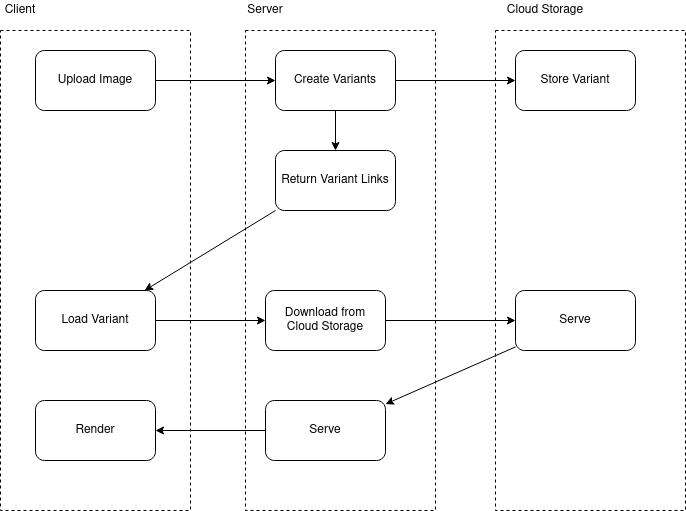
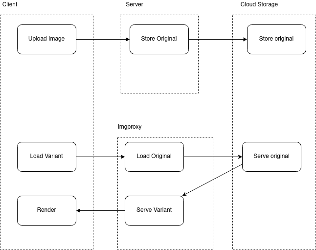

# Outline

1. What is Imgproxy?
2. Prototype implementation
3. Next steps

---

## Basics

Imgproxy is a service for on-the-fly <span class="highlight">image processing</span>

For more info see [imgproxy.net](https://imgproxy.net/)

---

<!-- .slide: data-background="#eeeeee" -->

## Current Implementation



---

<!-- .slide: data-background="#eeeeee" -->

## With Imgproxy



---

## Serving Variants I

```text
http://example.com/images/curiosity.jpg
```

```text
http://imgproxy.example.com/AfrOrF3gWeDA6VOlDG4TzxMv39O7MXnF4CXpKUwGqRM/fill/300/400/sm/0/plain/http://example.com/images/curiosity.jpg@png
```

---

## Serving Variants II

```text
gs://meistertask-staging-development-storage/dashboard_backgrounds/1/original/myfile.png
```

```text
http://imgproxy.example.com/Jg2ZznMhcLHoMv26TYy_w2cKzoZaHOEd3JmWVSAAgmU/rt:fit/w:250/plain/gs://meistertask-staging-development-storage/dashboard_backgrounds/1/original/myfile.png@jpg
```

---

## URL Signing

The image URL is _signed_ using secure keys, making it impossible to retrieve images without the correct salt.

More info here: [Signing the URL](https://docs.imgproxy.net/#/signing_the_url)

---

## Security

URL signing protects from:

- DoS
- Resource Enumeration

URL signing is not authorization, sharing a URL gives access.

---

## Ruby Client

```ruby
Imgproxy.url_for("gs://meistertask-staging-development-storage/dashboard_backgrounds/1/original/myfile.png",
  width: 250,
  resizing_type: :fit,
  format: :jpg)
```

---

## Prototype Implementation

- Serve some images using Imgproxy
  - MM: Avatars
  - MT: Dashboard Backgrounds
- Branches:
  - MM: [21-01-imgproxy-prototype](https://github.com/MeisterLabs/mindmeister/compare/master...21-01-imgproxy-prototype)
  - MT: [20-12-imgproxy-prototype](https://github.com/MeisterLabs/meistertask/pull/2338/files)

---

## Infrastructure

- Imgproxy runs on [Cloud Run](https://cloud.google.com/run/)
- Load Balancer & CDN with static asset caching enabled
- Imgproxy reachable under `hal.meistertask.com/imgproxy`

---

### Pros

- Simple to add into existing code base
- Fast & Maintainable
- Easy scaling
- Variants created on demand

---

### Cons

- Variants created on demand
- Additional cloud infrastructure needed (containers, CDN with caching...)
- Some functions (video thumbnailing) require pro license
- URL signing is not authorization

---

## Going forward

1. Staged rollout in Prod for MT
2. Implement in MM/Accounts/Note?
3. Extend to other models in MT
