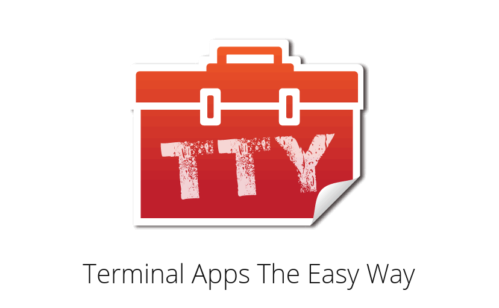

## Building Delightful Command-Line Apps in Ruby

---

Hi, I'm Hans 👋

💎 Ruby Developer from Vienna 🇦🇹

🔧 Working at [Meister](https://www.meisterlabs.com/) ⭐


Note:
Hi, I'm Hans
I'm a Ruby dev from Vienna and I'm currently working at Meister
I'm here to talk about command line apps or CLIs

---


Note: 
I love CLIs
We're developers, so we spend a lot of time on the terminal working with CLIs
Still, every time I get to interact with the command line I feel like a Hacker

---

```bash
rails new ...
rails generate controller ...
rails generate generate model ...
rails generate scaffold ...
rails db:migrate ...
```

Note: 
Here's a command line app that most of us use on a daily basis
A lot of people argue that a large part of what makes working with Rails so productive is actually it's command line interface
---

## It's just text 🤷

Note:
Now, what makes command line apps great to work with?
I mean, it's just text. There's no buttons or fancy UI components
What makes one command line app hard to use and another a delight?

---

1. Affordances & Signifiers
2. Feedback
3. No Surprises

Note: 
Turns out even though we don't have a fancy UI we can still apply some tried and true design principles
We should provide affordances and signifiers. Our app should let users know how to interact with it
It should provide clarity on what it can do and what the user needs to do to trigger it
Once the user has triggered an action, we should also provide feedback
If things go wrong we should show error messages. If there's progress, we should show progress and so on.
And no suprises. Don't tell your users the app does something while doing something else, like wiping their hard drive
Surprises make for bad user experience

---

# 💎 💓 CLIs

Note: 
Ruby is great for building CLIs
The Ruby ecosystem gives us some awesome tools for creating kick-ass command line apps out of the box

---


[http://whatisthor.com/](http://whatisthor.com/)

Note: 
We got Thor
Not that one, sadly
Thor is a Ruby library for writing command line apps

---

```ruby
# rails/railties/lib/rails/generators/base.rb 
module Rails
  module Generators
    class Base < Thor::Group
      # ...
    end
  end
end
```

Note: 
It actually serves as a base for Bundler and Rails 
If you use Rails generators, you use Thor
This is ripped straight from the Rails codebase. Rails the command line app is a thor app

---

```ruby
class EurukoCLI < Thor
  option :from, :required => true, desc: "Who is saying hello"
  option :shout, :type => :boolean, desc: "Upcase greetings if true"
  desc "hello", "say hello to Euruko from FROM"
  def hello
    output = "#{options[:from]} says: Hi Euruko!" 
    puts options[:shout] ? output.upcase : output
  end
end
```

Note: 
Remember about signifiers? Since we're operating with text providing signifiers means providing good documentation
Thor makes it incredibly easy to provide good documentation
It also makes it easy to provide different sorts of arguments to the user, and expose them
Like, believe me, this is way less fun in Bash

---



[https://ttytoolkit.org/](https://ttytoolkit.org/) by [Piotr Murach](https://twitter.com/piotr_murach/)

Note: 
Once we've told the user how to work with the app, we also want to provide feedback
We still only got text, but people got pretty good at doing fancy things with text
The TTY toolkit is a collection of gems to help you build nicer terminal apps

---


Note: 
You got spinners to show progress

---

```text
# ┌ main [===============               ] 50%
# ├── one [=====          ] 34%
# └── two [==========     ] 67%
```

Note: 
There's progress bar components

---


```bash
$ ruby pie.rb
           xxx***x
       xxxxxxx***xxxxx
    xxxxxxxxxx***xxxxxxxx
   xxxxxxxxxxx**xxxxxxxxxx
 xxxxxxxxxxxxx**xxxxxxxxxxxx
 xxxxxxxxxxxxx*xxxxxxxxxxxxx     * Slides Remaining 6.25%
xxxxxxxxxxxxxx*xxxxxxxxxxxxxx
xxxxxxxxxxxxxxxxxxxxxxxxxxxxx    x Slides Done 93.75%
xxxxxxxxxxxxxxxxxxxxxxxxxxxxx
 xxxxxxxxxxxxxxxxxxxxxxxxxxx
 xxxxxxxxxxxxxxxxxxxxxxxxxxx
   xxxxxxxxxxxxxxxxxxxxxxx
    xxxxxxxxxxxxxxxxxxxxx
       xxxxxxxxxxxxxxx
           xxxxxxx
```

Note: 
You can even make pie charts
I've never actually had the opportunity to use this one before
It's pretty cool
That brings me to the end - already

---

# Thank you!

[](http://hschne.at)
[](https://twitter.com/hschnedlitz)
[](http://github.com/hschne)

Notes:
Thank you to the beautiful people at Meister for their support
Thank you to the Euruko organizers for letting me get up here
And thank all of you for listening
