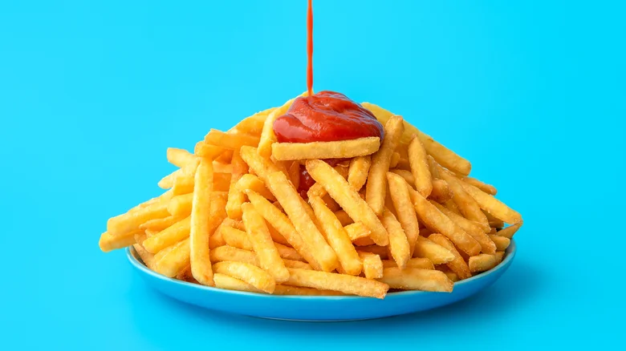
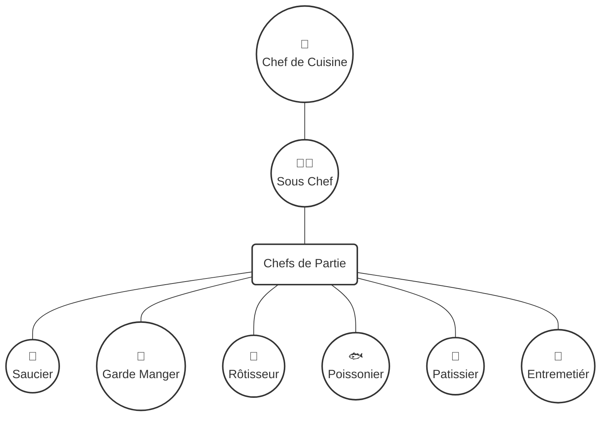

# Fresh Features, Julienne Cut

Hans Schnedlitz - Baltic Ruby 2025

<!--
- Hello everyone! I'm super excited to be here.
- What a day, right? So many amazing talks! 
- I don't know about you, but my brain is pretty fried
- But I do have some juice left in me, and I hope you do too.
-->

---
layout: image-left
image: /avatar.webp
---

# Hans Schnedlitz

Freelance Ruby/RoR Engineer 💎

- Vienna.rb Organizer 🇦🇹
- [@hansschnedlitz](https://bsky.app/profile/hansschnedlitz.bsky.social) <LogosBluesky /> 
- [hansschnedlitz.com](https://hansschnedlitz.com) 🌐
- Not a Chef ❌🧑‍🍳


<!--
- Hi, I'm Hans
- I've been doing Ruby on Rails since 2018
- I'm a freelance Ruby on Rails Engineer based in Vienna
- And I also organize the Vienna.rb local Ruby user group
- I'm not a chef.
- I like cooking as a hobby, I find it's a nice change of pace from coding
- Doing something with your hands, cutting, prepping
- Which is ironic, because I realized that cooking and coding share some weird similarities.
-->

---


# How to Build Software

1. Have an Awesome Idea 💡
2. Bit of Building 🏗
3. Profit! 💰

<!--
- Consider this high level overview of how build software works.
- It;s simple, right? You have an amazing idea for a new feature, you know what it should look and feel like
- Then you build it, that's the easy part, right. And then, profit, great success..
- Cooking really is no different.
-->

---

# How to Cook

1. Read the Recipe 📖
2. Bit of Cooking 🍲
3. Enjoy! 🍽️

<!--
- That's how it works for cooking. I feel like eating something delicious today, so I find a nice recipe.
- Then you know, a bit cooking, but that's the easy part, barely worth mentioning.
- Then enjoy. Easy.
-->

---
layout: image
image: /matter_replicator.webp
---


<!--
- You wish. Maybe in the future, when we have replicators.
- Computer, one Kaiserschmarren bitte.
-->

---
layout: image
image: /kaiserschmarren.webp
---

<!--
- Computer, one Kaiserschmarren bitte.
- I love Kaiserschmarrn, it's this delicious Austrian desert.
- If you're ever in Austria you should definitely give it a try.
- But I digress. We're not here to talk about the Austrian cousine, or Kaiserschmarrn
- Point is, things don't work that way. We don't have matter replication.  
- If you want your Kaiserschmarren you need to prepare our ingredients and assemble them into a fine meal ourselves.
- And because of that, technique, skill, knowing your tools, experience and so many other things still matter.
-->

---
layout: fact
---

# Building is Hard

<!--
- And with building software it's the same. Even in the age of LLMs that hasn't changed.
- Yes, figuring out what to build, the idea is important, but the execution is what really matters.
- Just as in cooking, it's about identifying your ingredients, prepping them in the right order and putting them together.
- How well you do that decides how well your product does.
- If you screw up your cooking, you'll have a meal that tastes bad.
- If you screw up your building, your product won't do so well.
- And one subset of this vast pool of skills that you need when building things is bereaking them apart 
- Which really is the focus of today.
-->

---
layout: image
image: /shape_up.webp
backgroundSize: contain
---


<!--
- Why do we have to break things apart. Why does that help us be better at building software?
- Ultimately it's about shipping faster and efficiency. That's the bottom line.
- And we can't very well do that if we have one huge chunk of work.
- We can't do that cognitively, it's hard to keep everything in your head.
- Programming is young, but I feel that's the one thing we have learned.
- It's what agile, shapeup, extreme programming, whatever is about
- Just last week I heard a talk about how GitHub deploys constantly
- And that's not possible if you create huge change requests.
-->

---
layout: statement
---

# Make Many Small Changes Fast

# Make One Big Change Slowly

<!--
- We have learned, that it's easier to make many small changes than making one big change.
- It's faster. But it also means I need to transform a big change into small changes
- We need to transform a n idea into a series of steps
-->

---
layout: image
image: /recipe.webp
---

<!--
- I need to transform this idea of 'I'm Hungry, I want my Kaiserschmarrn, right now!
- Into what need to do specifically to make it reality. 
- It's about creating a recipe by identifying the concrete steps to make our idea a reality
- And efficiently executing on it.
-->

---
layout: full
---

<div grid="~ cols-3 gap-1">



<v-click>


</v-click>
<v-click>


</v-click>

</div>

<!--
- Small interjection, how many ways are there to cut potatoes?
- It's a lot. Here's some favorites. There's the crincle cut, the scallop, the thing the tong.
- There are many ways to cut the potato, and there are many ways how to build software.
- What I'm doing here is just showing some, and getting you some ideas.
- This is not the do-all, end-all way, this is based on my experience and yours may differ.
- Anyway.
-->

---
layout: section
---

# Let's Build Something

<!-- 
- Let's do it, let's build something.
-->

---
layout: image
image: /carmy.webp
transition: fade
---


<!--
- Let's say I'm a restaurant owner as well as a cook. 
- I need a system for tracking what food makes it out the door, how much I sell
- And a big part of that is reporting
- It's important to me as a business owner 
-->

---
layout: image
image: /dhh-carmy.webp
---

<!--
- I'm also a Rails developer so naturally I'm building the thing myself
- I mean, why would I buy it if I can build it? It can't be that hard, right?
-->

---


<!--
- Right so we want to you know, have a breakdown by day, maybe per month too, of which foods were ordered
- And of course total profit for each, not just the total number
- I also want categories, right, desserts and stuff
- And filter by time, right, standard stuff
- Shouldn't be too complicated. But, let's think about this real quick.
- Maybe I give you a couple of seconds to think about how you'd break this down into smaller chunks.
- I think it's super interesting, how engineers approach features like that. It happens automatically right, us categorizing and grouping and thinking about how we'd implement each part.
-->

---
layout: two-cols-header
---

## TODO ☠️

::left::

<v-clicks>

- Graph
  - Group by days
  - Group by months
  - Group by tags
  - Details
- Filtering
  - Filter by month
  - Filter by arbitrary period
  - Filter by tags

</v-clicks>

::right::

<v-clicks>

- Graph Type
  - Count
  - Income

</v-clicks>


<!--
- Anyways. Maybe you came up with something like this.
- Maybe you were like, okay, there's different ways to group things and show them
- THere's also different filters, tags, different date ranges
- And yeah, we have this little toggle of count vs income
- That's one way to break this down
-->

---
layout: two-cols-header
---

## TODO ☠️

::left::

<v-clicks>

- DB
  - Queries for Grouping
    - By dates
  - Queries for filtering
    - By Dates
    - By Tags
- Controller
  - Graph Type Parameter
  - Filter Parameters

</v-clicks>

::right::

<v-clicks>

- UI
  - Graph
  - Date Filter Form
  - Tag Filter Form
  - Graph Type Toggle
  - Popover Details

</v-clicks>

<!--
- But what about this?
- We could also say, well there's a bunch of queries and DB stuff I need to implement
- On the controller level I need to handle the different parameters for filtering
- And on the UI side of things I need various forms, and obviously the graph
- I could break things down like this.
-->
---
layout: statement
---

# What just happened? 🤔

<!--
- Okay so what just happened. 
- We did break this thing apart. 
- We've gathered some ingredients to put into our beautiful feature soup.
- But how did we arrive at those ingredients specifically?
- We've grouped pieces of work based on some criteria.
- Which criteria did we actually use?
-->

---
class: text-center
---

# The Horizontal Cut

<div class="layers">
  <div class="layers__horizontal">
    <div>UI</div>
    <div>Controller</div>
    <div>Model</div>
  </div>
</div>

<!--
- We figured that some parts are related to a certain area of the stack. Like the UI, or the backend.
- I'd call this the horizontal cut, we are splitting our feature based on it's position in the stack, essentially.
- So there's some UI work, then some Backend work
-->

---
layout: two-cols
class: gap-2
---

```ruby
class Order < ApplicationRecord
  has_and_belongs_to_many :tags

  scope :with_tag, ->(tag) {
    joins(:tags) .where(tags: { name: tag })
  }
  scope :period, ->(start_date, end_date) {
    where(created_at: (start_date..end_date))
  }

  class << self
    def count_by(period)
      group(:name)
        .group_by_period(period, :created_at)
        .count
    end

    def price_by(period)
      group(:name)
        .group_by_period(period, :created_at)
        .sum(:price)
    end
  end
end
```
::right::

```ruby
class ReportsController < ApplicationController
  before_action :apply_filters, only: :index

  def index
    @chart_data = @type == "count" ?
      @orders.count_by(@period) :
      @orders.price_by(@period)
  end

  private

  def apply_filters
    @start_date = params.dig(:report, :start_date)
      &.to_datetime || DateTime.now.beginning_of_month
    @end_date = params.dig(:report, :end_date)
      &.to_datetime || DateTime.now.end_of_month
    @tags = params.dig(:report, :tags)
    @period = params.dig(:report, :period) || "day"
    @type = params.dig(:report, :type) || "count"

    @orders = Order.period(@start_date, @end_date)
    @orders = @orders.with_tag(@tags) if @tags.present?
  end

  # ...
end
```

<!--
- If we split like that we necessarily start building out some start of the stack first at some point
- In the most extreme case, we might implement the all the queries and models and controllers that we need in isolation.
- That is if we decide to tackle all those little chunks first
- That leaves us without a good way to actually interact with our stuff.
- Would that work well? Well, let's put a pin in that.
-->

---
class: text-center
---

# The Vertical Cut

<div class="layers ">
  <div class="layers__horizontal">
    <div></div>
    <div></div>
    <div></div>
  </div>
  <div class="layers__vertical">
    <div>Grouping</div>
    <div>...</div>
  </div>
</div>

<!--
- What's another way to cut things?
- You could call this the vertical cut
- Right, so we don't build out everything, but only a small slice of it.
-->

---


<!--
- For example, this could be just grouping foods and getting their counts
- No filtering, no categories, no money, you just get groups of foods per day.
- If you cut this way, necessarily, you end up with tiny parts of the feature implemented
-->

---

```html
<div class="container mx-auto px-4 py-8">
  <div class="mb-8">
    <h1 class="text-3xl font-bold text-gray-800 mb-6">Orders Dashboard</h1>

    <div class="bg-white p-6 rounded-lg shadow-md mb-8">
      <h2 class="text-xl font-semibold text-gray-800 mb-4">Orders by Name
      <%= column_chart @chart_data, height: "400px", stacked: true %>
    </div>
  </div>
```

```ruby
class ReportsController < ApplicationController
  def index
    @chart_data = Order
      .where(created_at: (DateTime.now.beginning_of_month..DateTime.now.end_of_month))
      .count_by("day")
  end
end
```

```ruby
class Order < ApplicationRecord
  class << self
    def count_by(period)
      group(:name)
        .group_by_period(period, :created_at)
        .count
    end
  end
end
```

<!--
- So you'd have a teeny tiny bit of view logic, rendering the chart
- And a small thing in the controller. No filtering
- And a minimal model. Again no filtering, no different ways to group.
- Literally, the bare bones you need to get this feature working.
-->

---
class: text-center
---

# Why not Both?

<div class="layers">
  <div class="layers__horizontal">
    <div></div>
    <div></div>
    <div></div>
  </div>
  <div class="layers__vertical">
    <div class="layer__vertical">
      <div></div>
      <div></div>
      <div></div>
    </div>
  </div>
</div>

<!--
- What's keeping you from slicing the vertical cut down further?
- Nothing, of course
- Programmers love recursion, and there's nothing from exercising some recursion here as well
- If it's large enough, you can do that
-->


--- 
layout: image
image: /pattern.webp
---

<!--
- Now, you might we wondering
- How do we know where to cut? How did we come up with this arbitrary grouping into vertical and horizontal slices?
- It's kind of obvious maybe, but how did we actually decide what belongs together?
- I don't have a clear answer for you.
- Humans are pattern matching machines, we start doing it from the moment we are born.
- Deeply human to categorize and feel what belongs together
- I have a one year old at home, and seeing him do it is wonderful. Like, how does he know that one thing is food and the other isn't? 
- Sometimes he just knows, and sometimes he gets it wrong, which is of course, also fun. 
- So pattern matching is something we do naturally. 
- In our case, we can still apply experience and expertise though. There just isn't a clear set of guidelines i can give you how to group things together.
-->
---
layout: section
---

# Slicing Features in Practice

<!--
- What I can give some guidelines to is when to apply which techniques, and other stuff to watch out for.
- In a way, we have our ingredients gathered, but there's more to do. In cooking, it's good to know that one part of the recipe is adding an onion.
- But you know, there's more to it. Some of the ingredients might need specific treatment. 
- We haven't talked about order either. It just makes sense that some things get done before others.
- Like, you wouldn't start with adding spices for most dishes
- So how do we chose which cuts to use when and what do do about the parts we end up with?
- Here's a couple of ideas.
-->

---

# Value First

- What is most valuable to the Customer? 💲
- Focus on delivering that _first!_
- Cut vertically, prioritize relevant slice
- Easy to get wrong ⚠️

<!--
- What creates value for the customer?
- You want to tackle the things first that provide the most value to the customer
- And you want to slice and dice in a way that enable you to do so.
- This is not easy to do. It's easy to get this wrong if you cut badly along the vertical
- You need to know what brings value to the customer, so you can deliver that thing first
-->

---
layout: image
image: /agile-skateboard.webp
backgroundSize: contain
---

<!--
- Who remembers this classic agile comic? I love it, because it's so wrong
- It's a great example of vertical cut. This assumes the customer wants a faster mode of transportation.
- What if that's not true? What if I need the care for moving things? For doing trips with my friends?
- What am I supposed to do with a skateboard then?
- The customer asked for some functionality, and we're not giving him that
-->

---
layout: image
image: /schnitzel.webp
---

<!--
- Similarly, if a customer asks for Wiener Schnitzel, which traditionally comes with Lemon, you can give him the lemon but that's not the same thing
- So be careful with what you actually deliver and what assumptions you make.
-->

---
class: text-center
---

# The Kitchen Brigade



<!--
- Let's talk about how things work if you're in a team
- Modern kitchens usually have all these roles. You have specialized cooks for different things
- And the benefit is clear, you get to parallelize. A dish might need a sauce and some meat and some sides.
- So the saucier makes the sauce and the rotisseur makes the meat and the garde manger makes the sides.
- Which is great, because they are specialzed. But what if there's blockage? 
- And more specifically in software, what happens when you put everything together?
-->

---
layout: image
image: /conflicts.webp
backgroundSize: contain
---

<!--
- Hopefully not this.
- Like, we all know this. If  you screw up, any efficiency gains you made by having multiple people on it are eliminated
- This is another thing to consider when slicing apart features.
- Can I parallelize, and what are the interdependencies of my slices? Does one slice depend on the other?
-->

---

## Horizontal Cuts Gone Wrong

<div class="layers">
  <div class="layers__horizontal horizontal-wrong">
    <div>UI</div>
    <div>⁉️</div>
    <div>Controller</div>
    <div>Model</div>
  </div>
</div>

<!--
- Story time, here's where horizontal cuts go really wrong
- Say, there's a frontend expert and a backend expert. You decide to build out the API first, and then the frontend expert will have a go at the UI.
- Sadly, the frontend expert starts working, they find that what you built is actually unsuitable for them. Uh oh. That's alot of time wasted.
- This happens a lot, so avoid doing horizontal cuts in isolation
-->

---

# Minimize Overhead

- Every slice creates more work 🔧
- Tickets, Testing, Reviews...
- Integrating slices into the whole is also work 🥵
- Results vary depending on your process 🤷

<!--
What causes the least overhead when integrating?
Because doing all this chop chop work is overhead.
- If you split your work into chunks, depending on your process you might have overhead for each chunk
- You do reviews, right? The more chunks you have, the more reviews you are going to do. additional testing. No way to dress this up, it is an effort.
- Each chunk may require testing, each chunk may need some other sort of verification
- And if you split too much, all that overhead might eat up any gains you made from splitting in the first place
-->

---
layout: two-cols-header
---

# Not Too Large, Not Too Small

::left::


::right::


---
layout: quote
class: text-center
---


# Substitutions

In the restaurant context, "substitutions" typically refer to changes a customer requests in their order, like swapping an ingredient, removing something, or adding a different side


<!--
- Before I go, I want to leave with some tools of the kitchen that can be extremely helpful.
- One tool we have at our disposal that cooks don't is we can mock things out
- The cook actually really has to prepare his ingredients. They can substitute ingredients though, we can do something similar
- We don't need to build everything out.
- Remember, we slice and dice. But we want to bring value. We can actually substitute mock implementation.

-->

---

# Substitute UI


<!--
- Consider the horizontal cut. Say, because the important part of our product is the UI, the design, the interaction. That's what's most critical to our customer, that's what we want to build first.
- We're gonna do some horizontal cuts and focus on the UI side of things first. Can we do that if we don't have any data?
- Sure thing! Nothing stops us from substituting functionality. Instead of retrieving data from the backend, we might just keep a fixed set of data in the browser.
-->

---
layout: image
image: /granite.webp 
---

<!--
- Now you might think there are some things that you absolutely cannot break down 
- Where it doesn't make sense
- IN my experience, that is the result of a lack of experience and creativity
- Think of the tools mocking
- Think of the benefits, accelerated release
- Nothing is impossible to cut
-->

---
class: text-center
layout: section
---

# Thank You!

Questions or remarks? Send them my way!

[@hansschnedlitz](https://bsky.app/profile/hansschnedlitz.bsky.social) <LogosBluesky /> / [hansschnedlitz.com](https://hansschnedlitz.com) 🌐
