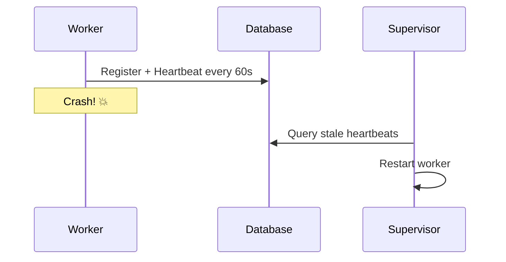

# Background Jobs from Scratch

Hans Schnedlitz

---
layout: image-left
image: /avatar.webp
---

# Hans Schnedlitz

Freelance Ruby/RoR Engineer 💎

- Vienna.rb Organizer 🇦🇹
- RubyConf Austria Co-Organizer 🎉
- [@hansschnedlitz](https://bsky.app/profile/hansschnedlitz.bsky.social) <LogosBluesky /> 
- [hansschnedlitz.com](https://hansschnedlitz.com) 🌐

<!--
Alright, hello everyone! Happy be here
This is my first talk at a meetup outside of Vienna, ever
Itty little bit about myself, I live in Vienna Austria
I've been working with Ruby since 2018
Since last year I'm organizing the Vienna.rb Ruby meetup in Vienna
And I'm also a co-organizer for Ruby Conf Austria, taking place next year
-->


---
layout: image
image: /rubyconf.webp
style: 'background-color: #e30818;'
---


<!-- And since we're already on that topic
You should totally come, it's barely 5 hours to Vienna by Train,
And it's gonna be special -->

---
layout: image
image: /rubyconf-speakers.webp
---

<!--
Staying inline with the Viennese heritage of Music
We're not only going to have amazing speakers like Dave Thomas or Jose Valim
But also awesome piano performances. The conference is gonna take place at the Muth, home to the Wiener Sängerknaben 
So yeah, not your usual conference, and I'm excited for it.
Okay, enough with the ads.  
-->


---
layout: cover
---

# Background Jobs from Scratch
<!-- 
So background Jobs. Back before I was a freelancer I worked as a pure backend kind of guy
and a big part of my job had to do with background jobs
Debug issues, keep them running, make them more reliable & performant
I don't get to do that much anymore, but I'm still interested in background jobs and how they work -->

--- 
layout: image
image: /later.webp
---

<!--
I guess it just resonates with me, why do something now if you can put it off, right?
I mean, it's a necessity, for any larger app. Emails, LiveStreaming updates with Hotwire,
Intense data wrangling, all best done in the background.
And because it's so ubiquitous, there's a bunch of them.
-->

---
layout: two-cols-header
---

# Background Jobs

... there's a lot of them 💎

::left::

<v-click>

- Sidekiq
- Resque
- Delayed Job
- Solid Queue

</v-click>

::right::

<v-click>

- GoodJob
- Que
- Shoryken
- Sucker Punch

</v-click>

<!--
Yeah so Sidekiq and it's predecessor Resque we might have all heard of
Same with Delayed Job & Solid Queue
GoodJob & Que 
Shoryken 
Sucker punch is an in-process job queu
And Today, we're gonna add our own, SimpleJob! 
Just as an exercise to learn about how those things actually work under the hood
And what differences there might be 
-->

---

# Builing SimpleJob

<v-clicks>

1. A Quick Overview
2. Implementing SimpleJob
3. ~~Profit~~ 💸
3. Why you _shouldn't_ implement background jobs from scratch 😈

</v-clicks>

<!-- So, this is an educational exercise. 
We're gonna do a quick overview, you know, rough architrecture stuff
Then we're gonna actually build it
And then we're gonna profit
But no actually, we'll learn about why maybe you shouln't build a background job system yourself
Or, at least, if you do, what to watch out for -->

---

# Your Jobs, Workers, and the In-Between

<div class="flex justify-center items-start h-full">

```mermaid { scale: 1.5}
flowchart LR
    A@{ img: "./jobs.webp", label: "Jobs", pos: "t", h: 140, w: 140, constraint: "on" }
    A --- B((??))
    B --- C@{ img: "./woz.webp", label: "Workers", pos: "t", h: 120, constraint: "on" }

    classDef default fill:transparent, stroke:#333, stroke-width:2px
```

</div>
<!--
So here's the rough overview, for those of you who have not yet had the pleasure to work with background jobs
On the one hand, we have our Jobs, our  business logic, that needs to be executed at some point in time. Later
Then, we have some component, workers, that need to actually take the work defined by Jobs I mean our jobs
And do the actual work. 
And then, and this is the fun part, some way to communicate between those parts. Your app, eseentially, and your workers
Because in most cases they are different processes, potentially running on different machines -->

---
layout: section
---

# Let's build SimpleJob

<!-- And that's the boring part already done, let's build -->

---

# Jobs & Queue Adapters

```ruby
class MyJob < ApplicationJob
  def perform
    puts "I work hard and party harder! 💪"
  end
end

MyJob.perform_later
```


<v-click>

```ruby
# lib/simple_job/adapter.rb
module ActiveJob
  module QueueAdapters
    class SimpleJobAdapter
      def enqueue(active_job)
        # Enqueue the job... but how? 🤔
      end
    end
  end
end
```
```ruby
# config/initializers/simple_job.rb
Rails.application.config.active_job.queue_adapter = :simple_job
```

</v-click>

<!--
First things first, what's our API look like. We're just gonna use ActiveJob for simplicity, 
So this is the application side of things. 
Super simple, this is an example job, this is how we would have our app perform this hard work later.
There's also some ceremony with ActiveJob involved, which are not _strictly_ needed
But if you want to make use of ActiveJob they are, so. 
We just need a job adapter, and tell our app to use that adapter. 
And of course, we need to implement the actual logic... might be tricky
-->

---
layout: image
image: /later.webp
---

<!--
Hmm, you know what, let's do that later
Let's first talk about the other easy part
The workers!
-->

---

# Workers

```ruby
module SimpleJob
  class Worker
    def start
      puts "SimpleJob Worker starting..."
      run
    end

    def run
      loop do
        break if @shutdown
        jobs = poll
        sleep(0.1) if jobs == 0
      end

      puts "\nSimpleJob Worker shutting down..."
    end

    def poll
      # Get some jobs and work them!
    end
  end
end
```

<!--
What's a worker. A worker, for the most part is just a standalone process that receives jobs from somewhere
And then works through them
The simplest way to implement a worker is to literally have it run on a loop. 
Polling whatever place jobs come from
And picking them up, executing them
Super super simple actually, not a bit of magic
-->

---

# The In-Between

<div class="flex justify-center items-start h-full">

```mermaid { scale: 1.5}
flowchart LR
    A@{ img: "./jobs.webp", label: "Jobs", pos: "t", h: 140, w: 140, constraint: "on" }
    A --- B((??)):::highlight
    B --- C@{ img: "./woz.webp", label: "Workers", pos: "t", h: 120, constraint: "on" }

    classDef default fill:transparent, stroke:#333, stroke-width:2px
```

</div>

<!--
Now, lets' do the fun part. How do we actually get a job from our main app to the worker?
They're different processes, maybe different machines
For the most part, there's always some sort of queue
Jobs are messages being dumped in the Queue, and workers pick them up from the queue.
And the queue can be anything really. It could be Redis, it could be an in Memory Queue, Kafka
Or it could be your database, using tables in such a way as to behave like message queues.
We build something simple, and incidentially the simplest way is to use the database and use ActiveRecord.
-->

---

# Let's Talk Tables

Write to enqueue, query to dequeue...

```ruby
class CreateSimpleJobTables < ActiveRecord::Migration[7.2]
  def change
    create_table :simple_jobs do |t|
      t.string :class_name, null: false
      t.text :arguments
      t.datetime :finished_at
      t.timestamps
    end
  end
end
```

<!-- So for our jobs and our workers to communicate we're gonna need a table
It's gonna be the smiple jobs table. And that's literally all the data we need in there for now
The classname of the job to be executed
The arguments the job takes
And a flag to tell us if a job has been done, think of this as is it still on the queue or has been processed.
That's it! -->

---

# ActiveRecord 🤝 SimpleJob

```ruby
module SimpleJob
  class Job < ApplicationRecord
    self.table_name = "simple_jobs"

    serialize :arguments, coder: JSON

    def self.enqueue(class_name, args)
      create!(
        class_name: class_name,
        arguments: args,
      )
    end
  end
end
```

<!-- 
Here's the corresponding model
Table name is clear
We encode the job arguemnts as Json
And we also have a simple enqueue method that just creates a record in the database.
-->


---

# Queue Adapters

```ruby {monaco-diff}
module ActiveJob
  module QueueAdapters
    class SimpleJobAdapter
      def enqueue(active_job)
      end
    end
  end
end
~~~
module ActiveJob
  module QueueAdapters
    class SimpleJobAdapter
      def enqueue(active_job)
        SimpleJob::Job.enqueue(
          active_job.class.name,
          active_job.serialize["arguments"],
        )
      end
    end
  end
end
```

<!-- Which we can now use in the SimpleJobAdapter
And there you have it, that's all we need to bridge the gap between jobs and workers
Almost, we need timplmeent the worker side of things
-->

---

# Workers

```ruby {monaco-diff}
module SimpleJob
  class Worker
    def poll
    end
  end
end
~~~
module SimpleJob
  class Worker
    def poll
      job = SimpleJob::Job.where(finished_at: nil).first
      return 0 unless job

      ActiveRecord::Base.transaction do
        execute(job)
        job.update!(finished_at: Time.current)
      end
      1
    end

    def execute(job)
      job_class = job.class_name.constantize
      job_instance = job_class.new
      job_instance.perform(*arguments)
    end
  end
end
```

<!-- Before we had this empty poll method that's executed in the loop
So now, this is straight forward. We grab a jobs from the table the qqueu that are not finished yet
And then in a transaction we execute it and set it's finished at so it doesn't get executed again!
exeuction is just a matter of instantiating the actuall job class
Remember, we stored that in the table too
And then calling it's actual perform method -->

---
layout: image
image: /jobs-happy.webp
---

<!-- And that's it really, it works
I'm not kidding, in realitly that's all you need for background jobs
What is that like 100 lines of code in Total?
So we're happy right? Right? -->

---

# This Sucks 🤮

What about my _Features_?

❌ Scheduling  
❌ Queues  
❌ Job priority  
❌ Recurring jobs  
❌ Retries  

<!-- 
Haha fuck no
What about my features? 
What about job queues? What about actual scheduling, what about priority?
Telling a job to run at a certain point in time, like monday morning, is kind of important, no?
What about recurring jobs & retries?
 -->
---

# This Sucks 🤮

What about _everything else_?

❌ Multithreading  
❌ Job recovery  
❌ Process heartbeats and supervisors  
❌ Query performance?!?  

<!--
Also, what about literally everyting else?
Safety, error handling, and performance?
-->
---
layout: image
image: /iceberg.webp
---

<!-- Now I can't really go into all of those
Especially since, when I wrote this presentation, I found that these things
features and non-functional requirements are interlinked
And also depend on technical choices, particularly, the middle layer, your queue infrastructure!
This is where it get's hard to illustrate, because some things are easy to solve with some infrastructures and basically impossible otherwise. 
Just for illustration, let's take a look at a performance problem that's particular to using the database as a message queue
-->

---

# The Problem with Polling

This is what treating your database as a queue gets you 🤷

```ruby
class CreateSimpleJobTables < ActiveRecord::Migration[7.2]
  def change
    create_table :simple_jobs do |t|
      t.string :class_name, null: false
      t.text :arguments
      t.datetime :finished_at
      t.timestamps
    end
  end
end
```

```sql
SELECT "simple_jobs".* FROM "simple_jobs" WHERE "simple_jobs"."finished_at" IS NULL ORDER BY "simple_jobs"."id" 
```

<!-- 
Remember we're using this simple jobs table to write our jobs
So this is the query we are using. What's the problem with this?
Yeah there's no indices, but a structural problem, that's exasperated if we add the feature to schedule jobs 
It's not unheard of to have hundreds of thousands of jobs sitting in the queue waiting to be executed
-->

---

# Just Add More Tables™

... to keep the polling table small

```ruby
  create_table "simple_job_ready_executions", force: :cascade do |t|
    t.datetime "created_at"
    t.bigint "job_id", null: false
    t.index ["job_id"], name: "index_simple_job_ready_executions_on_job_id", unique: true
  end
```

```ruby
module SimpleJob
  class ReadyExecution < ApplicationRecord
    self.table_name = "simple_job_ready_executions"

    belongs_to :job, class_name: "SimpleJob::Job"
  end
end
```

```sql
SELECT "simple_job_ready_executions".* FROM "simple_job_ready_executions" 
```

<!-- Now,  way to solve this is to just add more tables
This literally is what solid queue does. 
Add a new table for polling to keep the table you are querying small 
Now again, that's a very simplejob/ solidqueue problem.
-->

---

# GoodJob 📢

```ruby {all|3,16}
class Worker
  def start
    connection.execute("LISTEN good_job")

    loop do
      connection.wait_for_notify(timeout: 1) do |channel, payload|
        job = JSON.parse(payload)
        execute(job)
      end
    end
  end
end

def enqueue(job)
  Job.create!(job)
  connection.execute("NOTIFY good_job, job.to_json)
end
```

<!-- 
GoodJob for example, uses Postgres, and Postgres has listen and notify
So it literally doesn't have this problem.
-->

---

# Sidekiq ⚡

```ruby {all|4,12}
class Worker
  def poll
    loop do
      queue, job = redis.brpop("queue:default", timeout: 2)

      execute(job) if job
    end
  end
end

def enqueue(job)
  redis.lpush("queue:default", job.to_json)
end
```

<!-- 
Same with Sidekiq, literally uses Redis message queues, they don't have that issue.
Using Redis has other problems though!
-->

--- 
layout: two-cols-header
---


# What If Workers Die? 🪦

Processes die all the time. Sometimes with grace, sometimes quite unexpectedly.

::left::

```ruby
ActiveRecord::Base.transaction do
  execution.destroy!
  # 💥 Worker dies right here 💥
  execute(job) 
  job.update!(finished_at: Time.current)
end
```

::right::

<v-click>

- Solid Queue: Use a claimed state! 👌
- GoodJob: Use [Postgres Advisory Locks](https://www.postgresql.org/docs/current/explicit-locking.html#ADVISORY-LOCKS) 📣
- Sidekiq: Buy Sidekiq Pro 🤷

</v-click>

<style>

.two-cols-header {
  column-gap: 1rem; 
  row-gap: 2rem;
}
</style>
<!--
What if workers die? What we 100% want to avoid a job never being executed, are we okay with jobs being executed multiple times? 
Right now, in our implementation, a job will actually not get lost, but it can be executed multiple times
Solid Queue handles this using a claimed table to track which jobs are claimed
GoodJob uses Postgres Advisory Locks
Sidkiq can actually loose jobs, because when workers pick them up they are removed from the queue.
It just doesn't give a shit about that. Just buy Sidekiq Pro
-->

---

# Resurrecting Dead Workers 🧟



<!-- And speaking of dead workers
If all your workers die, as they are wont to, nothings remaining to execute your jobs
So you need some sort of jobs supervision, right?
Again, different queue mechanisms, different solutions
Generally, what pretty much everyone does is sending heartbeats
So a worker registered with a supervisor, sends a heartbeat
The supervisor checks for stale heartbeats 
And restarts workers accordingly
-->

---
layout: image
image: /iceberg.webp
---

<!-- 
So I hope I have whethed your appetite, showing you some of the basics and challenges waiting with background jobs
Builidng a background job system is easy until it's not.
On the surface, getting the basics can be super easy, but then, the more you get into it
The tricker things turn out to be.
Various features and requirements bite you in the ass quickly.
-->


---
layout: image
image: /viennarb.webp
---

<!-- One last add, 
if you're interested in hearing someone who actually knows what they're doing talk about this topic
Rosa Gutierrez who created Solid Queue is speaking at the next Vienna.rb on December 3rd 
-->

---
layout: end
---

# Thank you!


<!--
That's it from me, you can find these slides online, 
Now hit me up with your
Thank you! -->

---
layout: two-cols-header
---

# Sources & Resources

::left::

- [Solid Queue Internals and Externals](https://speakerdeck.com/rosapolis/solid-queue-internals-externals-and-all-the-things-in-between?slide=46)
- [How does Sidekiq really work?](https://dansvetlov.me/sidekiq-internals/)
- [Ben Sheldon's Blog](https://island94.org/posts/tags/goodjob)

::right::

- [Solid Queue for Ruby on Rails](https://blog.appsignal.com/2025/05/07/an-introduction-to-solid-queue-for-ruby-on-rails.html)
- [Solid Queue Source](https://github.com/rails/solid_queue/)
- [Sidekiq Source](https://github.com/sidekiq/sidekiq)
- [GoodJob Source](https://github.com/bensheldon/good_job)


<!-- Here's a bunch of stuff I used for research
I also wrote a series of articles for Appsignal, that go a bit deeper into how solid Solid Queue specifically
And of course, the best way to learn, read the source. 
-->
